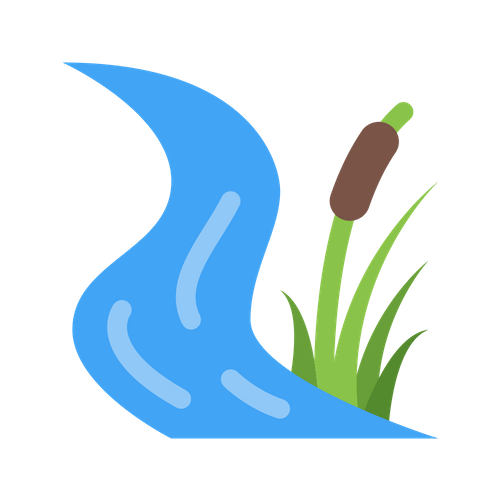

<a href="https://u17057842.github.io"><h1>u17057842.github.io</h1></a>

  

  <h3 align="center">Rivers of RSA</h3>

  

    Conservation of South Africa's river systems.
     
    <a href="https://github.com/u17057842/u17057842.github.io/issues/new?template=bug.md">Report bug</a>
    ·
    <a href="https://github.com/u17057842/u17057842.github.io/issues/new?template=feature.md&labels=feature">Request feature</a>
  

## Table of contents

- [Introduction](#introduction)
- [Technical aspects](#how-it-works)
- [Conservation rationale](#conservation)
- [Bugs and feature requests](#bugs-and-feature-requests)
- [How to help](#how-to-help)
- [Creators](#creators)
- [References](#references)
- [Copyright and license](#copyright-and-license)

## Introduction

Detail how to use

- Instruction 1
- Instruction 2
- Instruction 3

## How it works

Technical jargon

## conservation

Conservation facts

## Bugs and feature requests

If you have a problem(bug) or want to request a new feature, please first check the [issue guidelines](https://github.com/u17057842/u17057842.github.io/blob/master/CONTRIBUTING.md) to find previously submitted and corrected problems. If the feature or problem has not been previously mentioned, [please open a new issue](https://github.com/u17057842/u17057842.github.io/issues/new).

## How to help

Services to offer
Community involvement

## Creators

**u17057842**

- <https://github.com/u17057842>

## References

Scientific refrerences.

## Copyright and license

Code released under the [MIT License](https://github.com/u17057842/u17057842.github.io/blob/master/LICENSE).

